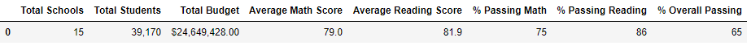

# School District Analysis with Pandas

## Overview of School District Analysis

### Purpose
The purpose of this school district analysis was to provide insight into the performance trends of reading and math standardized test data across 15 high schools. After completing the analysis, however, the school board found evidence of academic dishonesty in the reading and math grades for Thomas High School ninth graders. The analysis was run again, but this time, the math and reading scores for Thomas High School ninth graders were replaced with NaNs.

## Results

### District Summary
To produce the original Disctrict Summary, I created various series to form the columns and then combined them into a data frame.
 
 ```
school_count = len(school_data_complete_df["school_name"].unique())
student_count = school_data_complete_df["Student ID"].count()
total_budget = school_data_df["budget"].sum()
average_reading_score = school_data_complete_df["reading_score"].mean()
average_math_score = school_data_complete_df["math_score"].mean()
average_reading_score = school_data_complete_df["reading_score"].mean()
passing_math_count = passing_math["student_name"].count()
passing_math_count = school_data_complete_df[(school_data_complete_df["math_score"] >= 70)].count()["student_name"]
passing_reading_count = passing_reading["student_name"].count()
passing_reading_count = school_data_complete_df[(school_data_complete_df["reading_score"] >= 70)].count()["student_name"]
passing_math_reading = school_data_complete_df[(school_data_complete_df["math_score"] >= 70) & (school_data_complete_df["reading_score"] >= 70)]
overall_passing_math_reading_count = passing_math_reading["student_name"].count()
overall_passing_percentage = overall_passing_math_reading_count / student_count * 100

district_summary_df = pd.DataFrame(
          [{"Total Schools": school_count,
          "Total Students": student_count,
          "Total Budget": total_budget,
          "Average Math Score": average_math_score,
          "Average Reading Score": average_reading_score,
          "% Passing Math": passing_math_percentage,
         "% Passing Reading": passing_reading_percentage,
        "% Overall Passing": overall_passing_percentage}])
district_summary_df

```

The output from running the code produces the following data frame:



### School Summary
To create the School Summary, I created various series to form the columns and then combined them into a data frame.

```
# Determine the School Type
per_school_types = school_data_df.set_index(["school_name"])["type"]

# Calculate the total student count.
per_school_counts = school_data_complete_df["school_name"].value_counts()

# Calculate the total school budget and per capita spending
per_school_budget = school_data_complete_df.groupby(["school_name"]).mean()["budget"]
# Calculate the per capita spending.
per_school_capita = per_school_budget / per_school_counts

# Calculate the average test scores.
per_school_math = school_data_complete_df.groupby(["school_name"]).mean()["math_score"]
per_school_reading = school_data_complete_df.groupby(["school_name"]).mean()["reading_score"]

# Calculate the passing scores by creating a filtered DataFrame.
per_school_passing_math = school_data_complete_df[(school_data_complete_df["math_score"] >= 70)]
per_school_passing_reading = school_data_complete_df[(school_data_complete_df["reading_score"] >= 70)]

# Calculate the number of students passing math and passing reading by school.
per_school_passing_math = per_school_passing_math.groupby(["school_name"]).count()["student_name"]
per_school_passing_reading = per_school_passing_reading.groupby(["school_name"]).count()["student_name"]

# Calculate the percentage of passing math and reading scores per school.
per_school_passing_math = per_school_passing_math / per_school_counts * 100
per_school_passing_reading = per_school_passing_reading / per_school_counts * 100

# Calculate the students who passed both reading and math.
per_passing_math_reading = school_data_complete_df[(school_data_complete_df["reading_score"] >= 70)
                                               & (school_data_complete_df["math_score"] >= 70)]

# Calculate the number of students passing math and passing reading by school.
per_passing_math_reading = per_passing_math_reading.groupby(["school_name"]).count()["student_name"]

# Calculate the percentage of passing math and reading scores per school.
per_overall_passing_percentage = per_passing_math_reading / per_school_counts * 100

# Create the DataFrame
per_school_summary_df = pd.DataFrame({
    "School Type": per_school_types,
    "Total Students": per_school_counts,
    "Total School Budget": per_school_budget,
    "Per Student Budget": per_school_capita,
    "Average Math Score": per_school_math,
    "Average Reading Score": per_school_reading,
    "% Passing Math": per_school_passing_math,
    "% Passing Reading": per_school_passing_reading,
    "% Overall Passing": per_overall_passing_percentage})

per_school_summary_df.head()
```

I then formatted the Total School Budget and the Per Student Budget columns to include the dollar sign ($) and round to two decimal places.

```
per_school_summary_df["Total School Budget"] = per_school_summary_df["Total School Budget"].map("${:,.2f}".format)
per_school_summary_df["Per Student Budget"] = per_school_summary_df["Per Student Budget"].map("${:,.2f}".format)
```

The output from running the code
